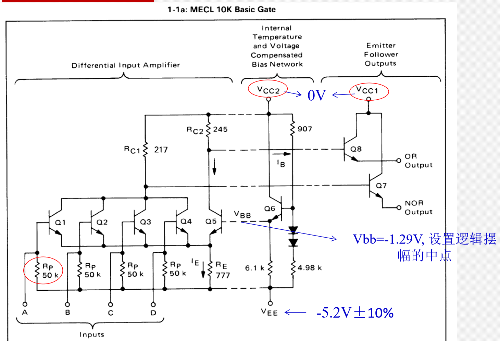

# ECL逻辑及使用

- [ECL逻辑及使用](#ecl%e9%80%bb%e8%be%91%e5%8f%8a%e4%bd%bf%e7%94%a8)
  - [ECL原理](#ecl%e5%8e%9f%e7%90%86)
    - [ECL基本门电路](#ecl%e5%9f%ba%e6%9c%ac%e9%97%a8%e7%94%b5%e8%b7%af)
    - [MECL电平](#mecl%e7%94%b5%e5%b9%b3)
    - [Noise Margin](#noise-margin)
    - [ECL特点及比较](#ecl%e7%89%b9%e7%82%b9%e5%8f%8a%e6%af%94%e8%be%83)
  - [ECL使用](#ecl%e4%bd%bf%e7%94%a8)
    - [基本考虑因素](#%e5%9f%ba%e6%9c%ac%e8%80%83%e8%99%91%e5%9b%a0%e7%b4%a0)
    - [常见传输线特征阻抗](#%e5%b8%b8%e8%a7%81%e4%bc%a0%e8%be%93%e7%ba%bf%e7%89%b9%e5%be%81%e9%98%bb%e6%8a%97)
    - [匹配](#%e5%8c%b9%e9%85%8d)
  - [ECL系统连接](#ecl%e7%b3%bb%e7%bb%9f%e8%bf%9e%e6%8e%a5)
    - [连接器](#%e8%bf%9e%e6%8e%a5%e5%99%a8)
    - [同轴电缆](#%e5%90%8c%e8%bd%b4%e7%94%b5%e7%bc%86)
    - [差分双绞线连接](#%e5%b7%ae%e5%88%86%e5%8f%8c%e7%bb%9e%e7%ba%bf%e8%bf%9e%e6%8e%a5)
    - [Ribbon Cable](#ribbon-cable)
  - [PECL](#pecl)

## ECL原理

ECL（Emitter Coupled Logic），
发射极耦合逻辑电路，也称电流开关型逻辑电路。
与TTL电路不同，
ECL电路的最大特点是其基本门电路工作在非饱和状态。
所以，ECL电路的最大优点是具有相当高的速度。
但逻辑摆幅小，对抗干扰能力不利。
由于单元门的开关管对是轮流导通的，
对整个电路来讲没有“截止”状态，所以单元电路的功耗较大。

ECL 集成电路的开关管对的发射极具有很大的反馈电阻，
又是射极跟随器输出，
故这种电路具有很高的输入阻抗和低的输出阻抗。
射极跟随器输出同时还具有对逻辑信号的缓冲作用。

主要缺点是制造工艺要求高，功耗大，抗干扰能力弱。
而且由于输出电压为负值，若与其他门电路接口，
需用专门的电平位移电路。

MECL：Motorola Emitter Coupled Logic

### ECL基本门电路

### MECL电平

- VIL: -1.850 ~ -1.475
- VIH: -1.105 ~ -0.810
- VOL: -1.850 ~ -1.650
- VOH: -0.960 ~ -0.810

### Noise Margin

噪声容限，指在前一极输出为最坏的情况下，
为保证后一极正常工作，所允许的最大噪声幅度。
高电平的噪声容限为：$V_{OH min} - V_{IHmin}$；
低电平的噪声容限为：$V_{IL max} - V_{OL max}$；

### ECL特点及比较

- 所有MECL均有独立的Vbb偏置驱动器，
  使之工作独立于较宽的温度范围，电源电压范围和电路功耗
- 均为发射极开路输出，方便传输线连接（MC1648 VCO例外） 
- 内部输入有50Ω下拉电阻，输入无连接默认为0
- 输入直流负载很小
- 确定的输出电流为22mA，最大输出电流50mA, 
  均可直接驱动50Ω传输线
- 从直流驱动角度扇出系数很大
- 均允许在输出端连接串联阻尼电阻
- 均有分离的Vcc，减少串扰
- 输出均有“线或”能力

## ECL使用

### 基本考虑因素

### 常见传输线特征阻抗

### 匹配

## ECL系统连接

### 连接器 

### 同轴电缆

### 差分双绞线连接 

### Ribbon Cable

## PECL
