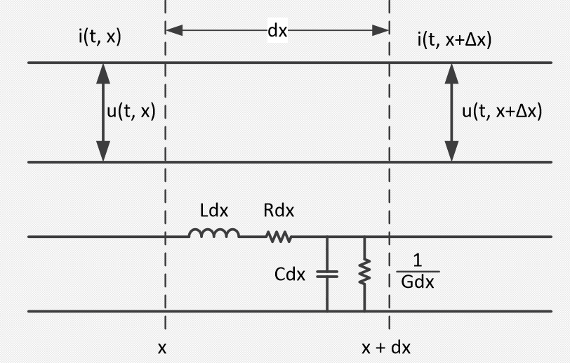
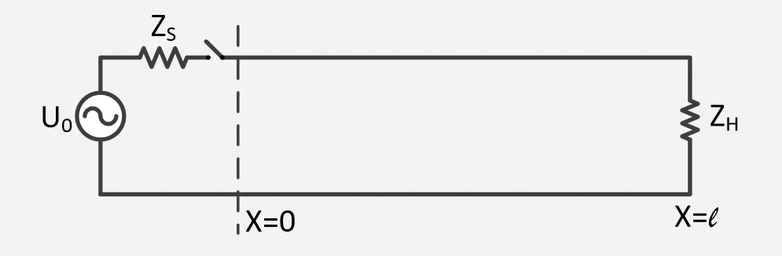
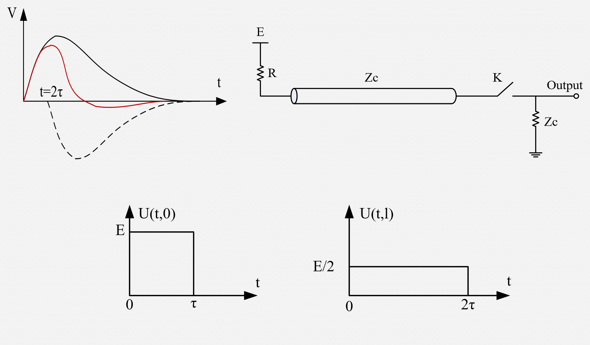
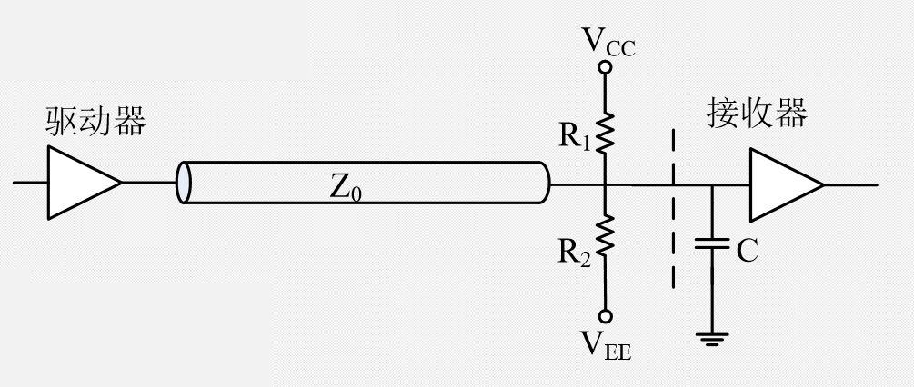
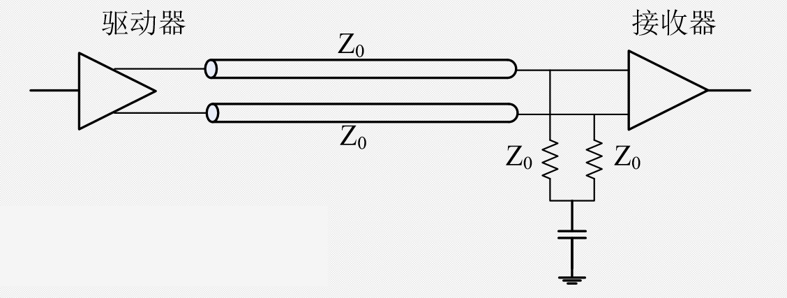
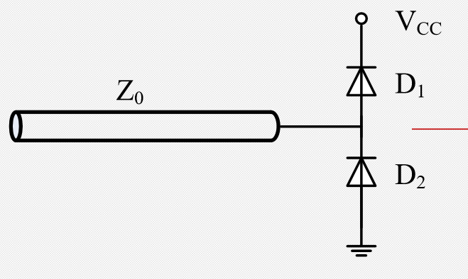
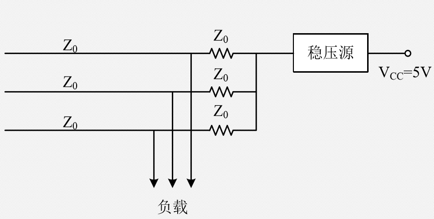

# 传输线理论

- [传输线理论](#%e4%bc%a0%e8%be%93%e7%ba%bf%e7%90%86%e8%ae%ba)
  - [典型的分布参数系统](#%e5%85%b8%e5%9e%8b%e7%9a%84%e5%88%86%e5%b8%83%e5%8f%82%e6%95%b0%e7%b3%bb%e7%bb%9f)
    - [电信号沿传输线的传播规律](#%e7%94%b5%e4%bf%a1%e5%8f%b7%e6%b2%bf%e4%bc%a0%e8%be%93%e7%ba%bf%e7%9a%84%e4%bc%a0%e6%92%ad%e8%a7%84%e5%be%8b)
    - [有限长无损耗传输线方程解的物理意义](#%e6%9c%89%e9%99%90%e9%95%bf%e6%97%a0%e6%8d%9f%e8%80%97%e4%bc%a0%e8%be%93%e7%ba%bf%e6%96%b9%e7%a8%8b%e8%a7%a3%e7%9a%84%e7%89%a9%e7%90%86%e6%84%8f%e4%b9%89)
    - [信号反射现象的利用](#%e4%bf%a1%e5%8f%b7%e5%8f%8d%e5%b0%84%e7%8e%b0%e8%b1%a1%e7%9a%84%e5%88%a9%e7%94%a8)
  - [传输线一些情形分析](#%e4%bc%a0%e8%be%93%e7%ba%bf%e4%b8%80%e4%ba%9b%e6%83%85%e5%bd%a2%e5%88%86%e6%9e%90)
    - [末端未匹配传输线](#%e6%9c%ab%e7%ab%af%e6%9c%aa%e5%8c%b9%e9%85%8d%e4%bc%a0%e8%be%93%e7%ba%bf)
    - [信号线中间有电容负载](#%e4%bf%a1%e5%8f%b7%e7%ba%bf%e4%b8%ad%e9%97%b4%e6%9c%89%e7%94%b5%e5%ae%b9%e8%b4%9f%e8%bd%bd)
    - [等间隔分布的电容负载](#%e7%ad%89%e9%97%b4%e9%9a%94%e5%88%86%e5%b8%83%e7%9a%84%e7%94%b5%e5%ae%b9%e8%b4%9f%e8%bd%bd)
    - [末端电容负载对信号上升时间的影响](#%e6%9c%ab%e7%ab%af%e7%94%b5%e5%ae%b9%e8%b4%9f%e8%bd%bd%e5%af%b9%e4%bf%a1%e5%8f%b7%e4%b8%8a%e5%8d%87%e6%97%b6%e9%97%b4%e7%9a%84%e5%bd%b1%e5%93%8d)
  - [传输线匹配技术](#%e4%bc%a0%e8%be%93%e7%ba%bf%e5%8c%b9%e9%85%8d%e6%8a%80%e6%9c%af)
    - [逻辑电路中长线的划分](#%e9%80%bb%e8%be%91%e7%94%b5%e8%b7%af%e4%b8%ad%e9%95%bf%e7%ba%bf%e7%9a%84%e5%88%92%e5%88%86)
    - [终端匹配](#%e7%bb%88%e7%ab%af%e5%8c%b9%e9%85%8d)
    - [有DC偏置的终端匹配](#%e6%9c%89dc%e5%81%8f%e7%bd%ae%e7%9a%84%e7%bb%88%e7%ab%af%e5%8c%b9%e9%85%8d)
    - [菊花链](#%e8%8f%8a%e8%8a%b1%e9%93%be)
    - [源端匹配](#%e6%ba%90%e7%ab%af%e5%8c%b9%e9%85%8d)
    - [中间匹配](#%e4%b8%ad%e9%97%b4%e5%8c%b9%e9%85%8d)
    - [末端匹配的交流偏置](#%e6%9c%ab%e7%ab%af%e5%8c%b9%e9%85%8d%e7%9a%84%e4%ba%a4%e6%b5%81%e5%81%8f%e7%bd%ae)
    - [二极管钳位终端](#%e4%ba%8c%e6%9e%81%e7%ae%a1%e9%92%b3%e4%bd%8d%e7%bb%88%e7%ab%af)
    - [有源匹配](#%e6%9c%89%e6%ba%90%e5%8c%b9%e9%85%8d)

## 典型的分布参数系统

集总参数网络和分布参数网络：
- 集总参数网络
  - 网络元件是集总参数元件，即元件参数集总在一个点上
  - 网络信号：仅是时间的函数
  - 行为描述方程：线性常微分方程
- 分布参数网络
  - 除集总参数元件之外，有沿空间分布的元件
  - 网络信号：时间和空间坐标的函数
  - 行为描述方程：线性偏微分方程

传输线：必须考虑延迟的连接线

- 平行导线
- 双绞线
- 同轴电缆

长线的每一段都有分布电容、电感、电阻。
单位长度上电感L、电容C、电阻R、电导G。
这些参数由传输线几何结构和绝缘介质特性决定的。

### 电信号沿传输线的传播规律

电报方程
$$
    - \frac{\partial u}{\partial x}
        = L\frac{\partial i}{\partial t} + iR
    \\
    - \frac{\partial i}{\partial x}
        = C\frac{\partial u}{\partial t} + uG
$$
消元可得
$$
    \frac{\partial^2 u}{\partial x^2} =
        LC\frac{\partial^2 u}{\partial t^2} +
        (CR + LG)\frac{\partial u}{\partial t} + RGu
$$
以及
$$
    \frac{\partial^2 i}{\partial x^2} =
        LC\frac{\partial^2 i}{\partial t^2} +
        (CR + LG)\frac{\partial i}{\partial t} + RGi
$$
对于理想情况，$R = 0, G = 0$，得到一维波动方程：
$$
    \frac{\partial^2 u}{\partial x^2} =
        LC\frac{\partial^2 u}{\partial t^2} \\
    \frac{\partial^2 i}{\partial x^2} =
        LC\frac{\partial^2 i}{\partial t^2} \\
$$
设边界条件如图所示：

用拉氏变换解方程，记
$$
    L i(t, x) = \bar{I}(S, x) \\
    L u(t, x) = \bar{U}(S, x)
$$
通解
$$
    \bar{U}(S, x) = A_1 e^{-nx} + B_1 e^{nx} \\
    \bar{I}(S, x) = A_2 e^{-nx} + B_2 e^{nx} \\
$$
其中$n=S\sqrt{LC}$。

特性阻抗
$$
    Z_C = \sqrt{\frac{L}{C}}
$$
反射系数
$$
    \rho = \frac{Z_H - Z_C}{Z_H + Z_C}
$$

始端匹配：$Z_S = Z_C$。
通解为
$$
    u(t, x) = \frac 1 2 U_0 \left(t-\sqrt{LC}x\right) +
        \frac 1 2 \rho U_0 \left[
            t - \sqrt{LC}(2l-x)    
        \right] \\
    i(t, x) = \frac{1}{2Z_C}\left\{
        \frac 1 2 U_0 \left(t-\sqrt{LC}x\right) -
        \frac 1 2 \rho U_0 \left[
            t - \sqrt{LC}(2l-x)    
        \right] \right\}
$$

### 有限长无损耗传输线方程解的物理意义 

$$
    u(t, x) = \frac 1 2 U_0 \left(t-\sqrt{LC}x\right) +
        \frac 1 2 \rho U_0 \left[
            t - \sqrt{LC}(2l-x)    
        \right]
$$
其中入射波为
$$
    U_0 \left(t-\sqrt{LC}x\right)
$$
反射波为
$$
    \rho U_0 \left[ t - \sqrt{LC}(2l-x)\right]
$$

传输线无损耗，设$t_1$时$x_1$处的波在$t_2$时传输至$x_2$处，
则
$$
    U_0 \left(t_1-\sqrt{LC}x_1\right)
        =
        U_0 \left(t_2-\sqrt{LC}x_2\right)
$$
即得
$$
    v = \frac{x_2 - x_1}{t_2 - t_1} = \frac{1}{\sqrt{LC}}
$$

几种特殊情况：
- $Z_H = Z_C$：终端匹配，无反射波
- $Z_H = 0$：终端短路，$\rho = -1$，全部反射，
  电压波相位不变，电流波相位相反
- $Z_H = \infty$：终端开路，$\rho = 1$，全部反射，
  电压波相位相反，电流波相位不变

<!--### 传输线物理解的直观获得-->

<!--### 信号在传输线上的多次反射过程-->

### 信号反射现象的利用

如图所示，K打开时电压波同相完全反射，K闭合后反射波消失。

## 传输线一些情形分析 

### 末端未匹配传输线

- 低内阻源端：
  - ECL、高速TTL驱动长线
  - 接收到的信号上下震荡，最终稳定
- 高内阻源端
  - CMOS驱动长线
  - 接收到的信号不断攀升到稳定值

### 信号线中间有电容负载 

电容和电容另一端总阻抗为$Z' = Z_C // \frac{1}{j\omega C}$。

电容处反射系数
$$
    R(\omega) = \frac{Z' - Z_C}{Z' + Z_C}
        = \frac{-j\omega C Z_C}{2+j\omega C Z_C}
$$
相当于RC电路，$RC = \frac{Z_C C}{2}$。
$$
    f_L = \frac{1}{\pi Z_C C}
$$
当频率大于$f_L$时几乎全部反射，小于$f_L$时反射像微分器，
反射脉冲等于输入阶跃的微分，微分常数等于$RC = \frac{Z_C C}{2}$。

### 等间隔分布的电容负载 

相当于增加了传输线的分布电容，
阻抗变小，延迟增加。

### 末端电容负载对信号上升时间的影响

始端匹配时，输出电压为
$$
    \frac{1}{2} V \left[ 1 + R(\omega) \right] =
        \frac{V}{1 + j\omega C Z_0}
$$
（$Z_0$为原传输线阻抗）

末端匹配时，输出电压为
$$
    \frac{V}{1 + j\omega C Z_0 / 2}
$$
相当于始端匹配时电容减小了一半的情况。

以50%为估算点，
附加上升时间$0.7Z_0C$（始端匹配）和$0.35Z_0C$（末端匹配）

## 传输线匹配技术

### 逻辑电路中长线的划分

根据信号上升时间$T_r$和该线上传输时间$T_{tran}$的比值确定。

- $T_r  / T_{tran} > 4$：集总参数
- $4 \ge T_r / T_{tran} > 2$：短线
- $T_r / T_{tran} \le 2$：长线

### 终端匹配 

- 驱动全波形一直沿电缆传输到底
- 反射波全部被阻尼掉
- 接受的电压等于传输的电压

负载的杂散电容影响上升时间
$T_{Term} = 2.2 \cdot \frac{Z_0}{2} C$。
信号总上升时间
$$
    T = \sqrt{T_{term}^2 + T_r^2}    
$$

### 有DC偏置的终端匹配

理想情况：$R_1 // R_2 = Z_0$

输出端静态电压：
$$
    \frac{R_1 V_{EE} + R_2 V_{CC}}{R_1 + R_2}
$$

### 菊花链

使用尽量短的连接长度，中间点无需匹配，仅在终端匹配

### 源端匹配

- 驱动波形在进入电缆处减半
- 驱动信号仅有一半沿传输线下传
- 末端反射系数为+1，入射、反射全幅度
- 反射波到达始端后被吸收
- 反射波到达始端后源驱动电流变为0

负载的杂散电容影响上升时间
$T_{Term} = 2.2 \cdot Z_0 C$。

### 中间匹配 

开始时没有注意匹配等，后来发现网络很乱，改善方法：

- 每一个驱动器增加源匹配
- 每个接收器用末端匹配
- 每个分叉点增加串联小电阻

上述方法仅是以衰减信号的途径改善网络的阶跃响应。

### 末端匹配的交流偏置

如上图所示的线路在驱动是DC平衡时，
上述可以减小R上的电压摆幅（1/2ΔV），
电容上的稳态电压是（1/2ΔV）。
但若不是DC平衡，高低电平波形将不对称。
下图所示差分驱动的情况总是DC平衡的。 

### 二极管钳位终端

- 能降低正负多余脉冲幅度
- 不增加直流负载。
- 有一定的响应时间，会降低系统的速度性能。

### 有源匹配

使用电源吸收到所有反射。

- 稳压源的电压值设在Hi和Lo之间
- 所有反射被稳压源吸收
- 对总线系统而言，各状态平均平衡，稳压源的静态功耗为0
- 摆幅为从中间值到Hi或Lo态。 
