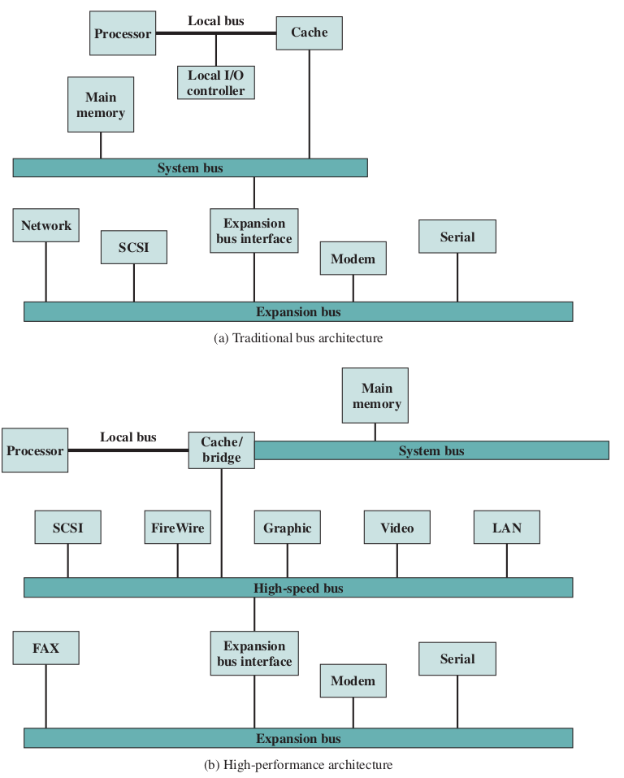

# 计算机功能和顶层互连

- [计算机功能和顶层互连](#%e8%ae%a1%e7%ae%97%e6%9c%ba%e5%8a%9f%e8%83%bd%e5%92%8c%e9%a1%b6%e5%b1%82%e4%ba%92%e8%bf%9e)
  - [指令的读取和执行](#%e6%8c%87%e4%bb%a4%e7%9a%84%e8%af%bb%e5%8f%96%e5%92%8c%e6%89%a7%e8%a1%8c)
  - [中断](#%e4%b8%ad%e6%96%ad)
  - [互连结构](#%e4%ba%92%e8%bf%9e%e7%bb%93%e6%9e%84)
    - [总线结构](#%e6%80%bb%e7%ba%bf%e7%bb%93%e6%9e%84)
    - [多总线层次结构](#%e5%a4%9a%e6%80%bb%e7%ba%bf%e5%b1%82%e6%ac%a1%e7%bb%93%e6%9e%84)
    - [总线的设计要素](#%e6%80%bb%e7%ba%bf%e7%9a%84%e8%ae%be%e8%ae%a1%e8%a6%81%e7%b4%a0)
      - [总线类型](#%e6%80%bb%e7%ba%bf%e7%b1%bb%e5%9e%8b)
      - [仲裁方法](#%e4%bb%b2%e8%a3%81%e6%96%b9%e6%b3%95)
      - [时序](#%e6%97%b6%e5%ba%8f)
      - [总线宽度](#%e6%80%bb%e7%ba%bf%e5%ae%bd%e5%ba%a6)
      - [数据传输类型](#%e6%95%b0%e6%8d%ae%e4%bc%a0%e8%be%93%e7%b1%bb%e5%9e%8b)
    - [PCI](#pci)
      - [总线结构](#%e6%80%bb%e7%ba%bf%e7%bb%93%e6%9e%84-1)
      - [PCI命令](#pci%e5%91%bd%e4%bb%a4)
      - [仲裁](#%e4%bb%b2%e8%a3%81)


**硬布线程序**是指一个专门的用于特殊计算的逻辑单元配置。
这种连接元件形成配置的过程也可以视为一种编程，得到的程序以硬件的形式存在。
现在通常采用另一种方案，即构造一个具有算数和逻辑功能的通用结构。
这样不再需要为每个程序重构硬件，只要提供新的代码序列（**软件**）。

计算机程序由存储在存储器中的一串指令组成。一条指令所需要的处理过程称为**指令周期**，
其中又可以分为两个步骤，即**取指周期**和**执行周期**。

## 指令的读取和执行

典型处理器中用一个寄存器，称为程序计数器（PC）来保存下一条要执行的指令的地址。
一般除非特殊说明，每次取指之后PC变为上次的增量。
读取的指令放入指令寄存器（IR）之中，指令一般可以分为四类：

- **处理器-存储器**：出局可以从处理器和存储器之间相互传递
- **处理器-I/O**：由此数据可以传送到外部设备
- **数据处理**：对数据进行算数或逻辑操作
- **控制**：改变指令执行顺序

某个特定指令的执行周期可能包含对存储器的多次访问。指令执行过程中可能包括多个状态
（其中有些状态可能出现多次，有可能不出现），描述如下：

- **指令地址计算（iac）**：决定下一条指令的地址，通常是讲一个固定的值与前一条指令的地址相加
- **读取指令（if）**：将指令充存储器单元读取到处理器中
- **指令操作译码（iod）**：分析指令，决定将之心和中操作以及将使用的操作数
- **操作数地址计算（oac）**：若指令中包括对存储器中或通过I/O的操作数的访问，则决定操作数的地址
- **取操作数（of）**：从存储器或I/O中读取操作数
- **数据操作（do）**：完成指令所需操作
- **存储操作数（os）**：将结果存入存储器或输出到I/O

如PDP-11中的指令`ADD A, B`（将存储器中数据相加并存回存储器）将导致一下状态序列：
```
    iac->if->iod->oac->of->do->oac->os
```

## 中断

当**中断请求信号**发送到处理器后，处理器通过挂起当前程序的操作，跳转至**中断处理程序**来响应。
执行完后又恢复原来的执行。为了适应中断，在指令周期中加入**中断周期**，检查是否发生中断。
如果出现中断请求，会挂起当前程序，保存当前状态，并将PC设为中断处理程序首地址。
多重中断的处理有两种方法：

- 在中断处理过程中禁止中断。此时如再发生中断会处于未决状态，允许中断后会检测这种未决状态并进一步处理。
这样做没有考虑到优先级和时间紧迫性，如果在第一批数据开始处理之前第二批数据就到来，可能会导致丢失数据。
- 第二种方法是定义中断的优先级，允许高优先级中断打断低优先级中断。

## 互连结构

连接各模块的通路的集合称为互连结构。其结构取决于模块间必要的交换。通常，互联结构必须支持以下类型的传送：

- 存储器到处理器
- 处理器到存储器
- I/O到处理器
- 处理器到I/O
- I/O和存储器之间（使用DMA）

迄今为止最普遍的互连结构是总线和各种多总线结构。

总线是连接两个或多个设备的通路，关键特征是共享传输介质。
计算机系统有多种总线，连接计算机主要部件（处理器、存储器、I/O）的总线称为系统总线。

### 总线结构

总线的设计有很多种，但任何总线的线路都可以分为三个功能组，即**数据线**、**地址线**和**控制线**。此外还有为连接的模块提供电源的电源馈线。

- **数据线**提供系统模块间传送数据的路径，折现线组合到一起成为数据总线。
    导线的数目称为数据总线的宽度，决定了每次能同时传送多少位。
    数据总线宽度是决定系统总体性能的关键因素。
- **地址线**用于指定数据总线桑数据的来源和去向，通常也用于I/O端口的寻址。
- **控制线**用来控制对数据线和地址线的存取和使用。控制信号在系统模块之间发送命令和时序信号。典型的控制信号包括：
  - 存储器写
  - 存储器读
  - I/O写
  - I/O读
  - 传输相应
  - 总线请求
  - 总线允许
  - 中断请求
  - 中断响应
  - 时钟（用于同步操作）
  - 复位

总线的操作如下：
- 一个模块向另一个模块发送数据，需要
  - 获得总线的使用权
  - 通过总线传送数据
- 一个模块向另一个模块请求数据，需要
  - 获得总线的使用权
  - 通过适当的地址线和控制线向另一模块发送请求
  - 等待另一模块发送数据

### 多总线层次结构


如果将大量设备连到总线上，性能将会下降。主要原因包括：

- 总线上设备越多，总线越长，传输延迟越大，设备协调总线花费的时间就越长。
- 聚集的传输请求接近总线容量时，总线会成为瓶颈。

多数计算机系统使用多总线，通常为层次结构。如上图所示。
这种方法的好处是，高速总线使钢需求设备与处理器有更好的集成又独立于处理器。
不同处理器和告诉总线速度以及信号线定义都可以兼容。

### 总线的设计要素

几个总线的基本参数和设计要素包括

- 类型：专用/复用
- 仲裁方法：集中式/分布式
- 时序：同步/异步
- 总线宽度：地址/数据
- 数据传输类型：读/写/读-修改-写/写后读/块

#### 总线类型

总线可以分为专用和复用两种类型。
专用总线始终只负责一项功能，或始终分配给计算机的一个物理子集。
例如分立专用的地址线和数据线。而与之相对的另一种方法可以是分时复用。
**分时复用**的优点是布线少，节省空间和成本；缺点是在每个模块需要更复杂的控制电路，且可能导致性能降低。
**物理专用总线**指使用多条总线，每条总线只与模块的一个子集相连接。如I/O总线。
其优点是总线冲突少，具有更高的吞吐量，缺点是增加了系统的成本和规模。

#### 仲裁方法

由于总线上可能有多个模块需要控制总线，而每次只有一个器件可以成功发送数据，所以需要某种仲裁方法。
集中式的方法中，使用总线控制器（或称仲裁器）负责分配总线时间。这个设备可以是独立的模块或CPU的一部分。
分布式的方法中，在每个模块中包含访问控制逻辑，折现模块共同作用、分享总线。
这两种方法都将指定一个设备作为主控器对其他设备（作为从属设备）启动数据传输（读或写）。

#### 时序

对于同步时序，总线上的事件的发生由时钟决定。总线上的其他设备都能读取时钟线，所有事件都在时钟周期开始时发生。
对于异步时序，总线上的事件的发生取决于上一个事件的发生。
同步时序的实现和测试都简单，但没有异步时序灵活，难以发挥高性能设备的优势。

#### 总线宽度

地址总线的宽度对系统容量有重要影响，而数据总线的宽度影响系统性能。

#### 数据传输类型

所有的总线都支持写（主控制器到从属设备）和读（从属设备到主控制器）的传输。
在复用型地址/数据总线中，总显现用于指定地址，然后用于传输数据。
对于读操作，数据从从属设备取得并放到总线上时，典型的情况时有一个等待。
此外无论读写，如果通过仲裁为其他操作去的总线控制权，也同样存在延迟。
在专用的地址/数据总线中，地址放到地址线上并一直保持到数据出现在数据线上。
某些总线允许几种组合操作。“读-修改-写”操作时再度之后紧接着向同一地址写数据，
地址仅在操作开始时广播一次。整个操作是不可分的，这是为了在多道程序中保护共享的存储器。
“写后读”是另一种不可分割的操作，这个读操作可用于校验。
有的总线支持数据块传输，此时一个地址周期后面跟着n个数据周期。

### PCI

PCI总线，即外设部件互连总线，是一种高带宽、独立于存储器的总线。
其可以作为中间层或外围设备总线。它为高速I/O子系统提供更好的性能。
当前标准允许在66MHz下使用64根数据线，理论速率可达4.224Gb/s。
PCI是专门为现代操作系统I/O要求设计的较经济的总线，实现它只需要很少的芯片。

#### 总线结构

PCI可配置为32或64位总线。对于49线PCI，所需的信号线可分为以下几组：

- **系统引脚**：包括时钟和复位引脚
- **地址和数据引脚**：32根分时复用地址/数据线
- **接口控制引脚**：控制时序、协调发送端和接收端
- **仲裁引脚**：每个PCI主控器有自己的一对仲裁线，直接连到PCI总线仲裁器上
- **错误报告引脚**：报告奇偶校验位错误等

PCI定义的其余可选信号线包括：

- 中断引脚
- 高速缓存支持引脚
- 64位总线扩展引脚
- JTAG/边界扫描引脚

#### PCI命令

在地址传送周期，C/BE（命令/字节）信号线用于指示传送类型。命令包括：

- **中断响应**：是一条读命令，使设备作为PCI总线上的中断控制器。
- **特殊周期**：用于发送端向一或多个目标广播消息。
- **I/O读**：在发送端和I/O控制器之间传送数据。
- **I/O写**：在发送端和I/O控制器之间传送数据。
- **存储器读**：传送激发数据的突发式传输，占用一或多个时钟周期。
- **存储器读行**
- **存储器读多行**
- **存储器写**：传送激发数据的突发式传输，占用一或多个时钟周期。
- **存储器写和无效**
- **配置读**
- **配置写**
- **双地址周期**

#### 仲裁

PCI使用集中式的同步仲裁方法，主控方有独立的请求信号和允许信号，连接到中央仲裁器上。
PCI规范未规定仲裁算法，可以使用先到先服务或轮转方法等。
仲裁可以在当前主控方进行数据传输的时候同时发生，不浪费总线周期，称为“隐式仲裁”。

